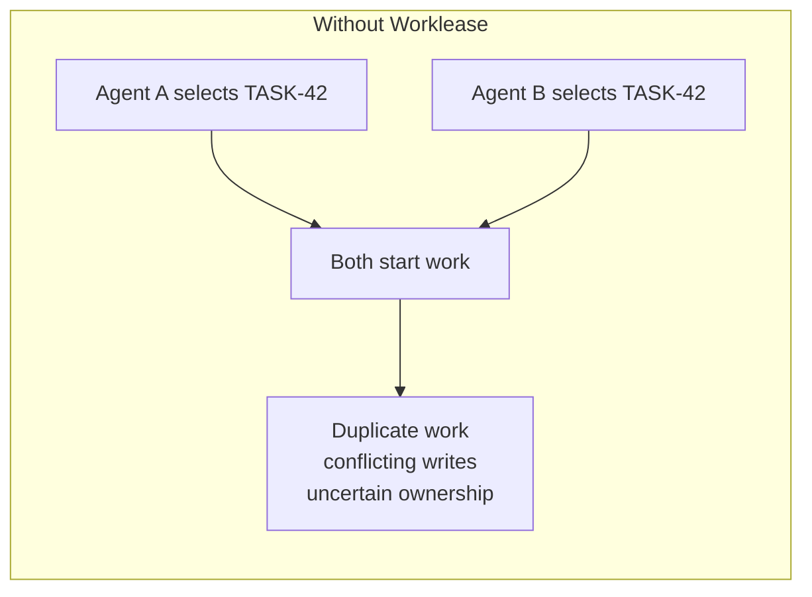
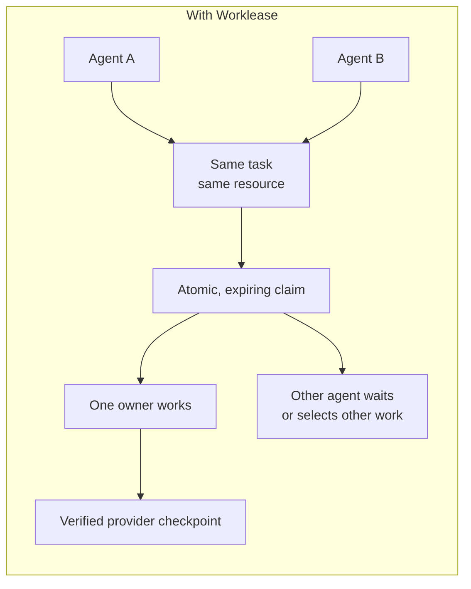

# worklease

`worklease` coordinates humans and agents working on the same host. A caller derives an opaque resource key, acquires a time-limited ownership epoch, performs guarded work, verifies the authoritative provider checkpoint, and releases the lease.

Worklease guards local operations. The caller's backlog or work system remains authoritative for discovery, dependencies, progress, review, and completion. A same-host lease is not distributed locking or provider-side fencing.



The work could be a Linear ticket or a task defined in a markdown file.



Same work derives the same resource, which gets one bounded owner. Read [how resources, claims, and operations fit together](docs/claim-model.md) for the complete model.

## Features

- Provider-neutral keys (`backlog-md`, `github`, `linear`, `markdown`, `generic`) and versioned external Python plugins.
- Atomic leases and ordered all-or-nothing 1–32-resource bundles, TTLs, bounded waits/checkpoints, heartbeats, monotonic revisions, transfers, and releases.
- Guarded argv execution, routed directories, bounded output, and SHA-256 file replacement; `--coordination-only` claims are non-fencing.
- Idempotent operations, receipts, and singleton/bundle unknown-outcome reconciliation.
- Redacted diagnostics, file/FD tokens, deterministic text, versioned JSON, schemas, stable exit codes, and typed Python API.
- Transactional retention/GC, portable agent workflow, source-provider SDK/mappings, and checksummed Python/native releases.

## Install

Requires Python 3.14 or newer for source installs.

```sh
uv tool install .
worklease --version
```

Tagged releases include checksummed Python packages and native executables. With [mise](https://mise.jdx.dev/), add this to `mise.toml`:

```toml
[tools]
"github:brettinternet/worklease" = "latest"
```

Then run `mise install`. Pin a version by replacing `latest` with `vX.Y.Z`.

### Install the agent skill

Ask your agent to follow [`skills/AGENTS.md`](skills/AGENTS.md). The portable
Agent Skills bundle is [`skills/worklease-workflow/`](skills/worklease-workflow/);
install that complete directory at the same Git tag as the CLI. The agent must
use its documented skill installer or discovery directory rather than assuming
a product-specific path. Skill installation does not install the CLI.

For example, tell your agent: “Read
`https://github.com/brettinternet/worklease/blob/vX.Y.Z/skills/AGENTS.md` and
install the Worklease skill for this agent.”

For a verified direct install, use:

```sh
WORKLEASE_REPOSITORY=brettinternet/worklease \
  mise run install-release VERSION=vX.Y.Z
```

This verifies the SHA-256 manifest and `--version`, preferring a native asset and falling back to the universal wheel through `uv`. Set `WORKLEASE_INSTALL_DIR` to change the destination. See [GitHub Releases](https://github.com/brettinternet/worklease/releases) for all assets.

## Core lifecycle

The CLI emits compact human-readable text by default. Use `--json` (or
`--format json`) for the schema-versioned JSON automation contract; `--format
text` is an explicit equivalent. Output selection may appear before the
top-level command or after the command's final subcommand name, but `--json`
cannot be combined with `--format`.

### 1. Derive one exact resource

Every contender for the same logical work must use the same provider, source, and item identity:

```sh
worklease key \
  --provider backlog-md \
  --source docs/backlog \
  --item TASK-42
```

The response declares the claim scope and guarantee. Use `--coordination-only` when the provider write occurs outside a Worklease-guarded local operation. Never describe local coordination as provider-side fencing.

### 2. Acquire a fresh ownership epoch

Keep the agent ID stable for the logical agent. Generate fresh claim, session,
owner/worker-attempt, and operation IDs for each attempt:

```sh
worklease acquire \
  --resource "$RESOURCE" \
  --claim-id "$CLAIM_ID" \
  --agent-id "$AGENT_ID" \
  --session-id "$SESSION_ID" \
  --owner-id "$OWNER_ID" \
  --work-key "implement:TASK-42" \
  --ttl 900
```

To wait for a singleton resource without a check-then-acquire race, add a
finite timeout. Acquisition retries the same atomic operation only for active
singleton contention (`already-claimed`) or a transient local resource guard
(`resource-guarded`):

```sh
worklease acquire \
  --resource "$RESOURCE" \
  --claim-id "$CLAIM_ID" \
  --agent-id "$AGENT_ID" \
  --session-id "$SESSION_ID" \
  --owner-id "$OWNER_ID" \
  --work-key "implement:TASK-42" \
  --wait-timeout 30 \
  --poll-interval 0.25
```

`--wait-timeout` is finite and non-negative; zero performs one immediate
attempt. `--poll-interval` defaults to `0.25` seconds and is valid only with
`--wait-timeout`; it must be finite and greater than zero. A timeout returns
the last contention error with exit code `2` and never exposes a bearer token.
Bundle members, including expired bundles, return
`bundle-operation-required` immediately and must use the bundle lifecycle.

Save the returned token and revision. The token appears only in successful mutation responses. Prefer a mode-0600 `--token-file` or inherited `--token-fd`; direct `--token` is supported but exposes the bearer secret in argv. Never put a token in logs, comments, checkpoints, or handoffs.

Heartbeat before half the lease elapses and around long operations. Every successful mutation advances the revision; always use the newest returned value.

```sh
worklease heartbeat \
  --resource "$RESOURCE" \
  --claim-id "$CLAIM_ID" \
  --token-file "$TOKEN_FILE" \
  --revision "$REVISION" \
  --operation-id "heartbeat-TASK-42-001" \
  --ttl 900
```

### 3. Inspect or execute

Read-only commands never expose bearer tokens:

```sh
worklease status --resource "$RESOURCE"
worklease status --resource "$RESOURCE" --verbose
worklease list --resource "$RESOURCE"
```

Run guarded commands as argv, without a shell string:

```sh
worklease exec \
  --resource "$RESOURCE" \
  --claim-id "$CLAIM_ID" \
  --token-file "$TOKEN_FILE" \
  --revision "$REVISION" \
  --operation-id "test-TASK-42-001" \
  --git-primary \
  -- python -m unittest discover -s tests -v
```

Use `--provider-directory DIR` instead of `--git-primary` for an explicit checkout. Provider execution strips Git repository-routing variables while preserving identity, configuration, and credentials. The resolved directory is part of the idempotent request.

Operation IDs are idempotency keys. Replay only the identical request to recover a lost response; never reuse an ID for changed inputs. If an operation reports `unknown-outcome`, inspect it and verify the authoritative external result before recording reconciliation:

```sh
worklease inspect-operation \
  --resource "$RESOURCE" \
  --operation-id "test-TASK-42-001"
```

For `exec-bundle`, use `inspect-operation-bundle` and
`reconcile-operation-bundle`, repeating `--resource` in the exact acquisition
order. Reconciliation requires the current bundle claim ID, token, and revision;
it advances the whole bundle atomically and returns a redacted claim.

Do not automatically rerun an uncertain external command.

### 4. Checkpoint and release

`checkpoint` stores bounded coordination metadata; it is not provider progress:

```sh
worklease checkpoint \
  --resource "$RESOURCE" \
  --claim-id "$CLAIM_ID" \
  --token-file "$TOKEN_FILE" \
  --revision "$REVISION" \
  --operation-id "checkpoint-TASK-42-001" \
  --checkpoint '{"phase":"tests","result":"passed"}'
```

Before release, update or reread the authoritative provider and verify its expected version and state. Then release the exact current epoch with the newest revision:

```sh
worklease release \
  --resource "$RESOURCE" \
  --claim-id "$CLAIM_ID" \
  --token-file "$TOKEN_FILE" \
  --revision "$REVISION" \
  --operation-id "release-TASK-42-001" \
  --reason "provider checkpoint verified"
```

Stop on ownership loss, provider-version conflict, missing receipts, or unknown outcomes. An assignee, status, comment, branch, worktree, lock file, local cache, or command exit status is not a claim or a verified provider checkpoint.

## Common patterns

Singleton command: derive one stable local resource such as `local:formatter`, acquire it, run one argv through `exec`, and release the returned revision.
Scarce resource: use one shared identity such as `local:port:8080` or
`local:gpu:0`. Use singleton `acquire --wait-timeout` to wait for release or
expiry without a check-then-acquire race; do not steal it. Bundle members
require the bundle lifecycle and are never waited on by singleton acquisition.

Source-wide Markdown update: derive a `markdown` key for the file, acquire the source claim, and use `replace-file` with the current SHA-256. The expected hash and atomic replacement fence that one local file mutation. A coordination-only claim cannot call `replace-file`.

Multi-resource operation: use `acquire-bundle`, `heartbeat-bundle`, `exec-bundle`, `inspect-operation-bundle`, `reconcile-operation-bundle`, and `release-bundle` for 1–32 exact ordered resources. Bundle acquisition, reconciliation, and revision changes are all-or-nothing, but retain the same same-host boundary as singleton claims.

Guarded commands continuously drain both output streams. Receipts retain at most 1 MiB of UTF-8 output per stream and report `stdoutBytes`/`stderrBytes` (total raw bytes observed) plus `stdoutTruncated`/`stderrTruncated`; small output is returned unchanged.

Remote provider without conditional writes: acquire with `--coordination-only`; revalidate the claim, provider eligibility, and provider version before each direct API/CLI mutation; perform the write; then reread both claim and provider state. Retain the provider receipt and stop on conflict or ambiguity.

## Boundaries and agent contract

Built-in resource policies derive deterministic local identities and declare scope and capability. They do not discover work, authenticate to providers, schedule dependencies, write progress, establish review boundaries, or prove provider fencing. External Python distributions can add policies through the `worklease.resource_policies` entry-point group; frozen executables expose built-ins only.

```sh
worklease policy list
worklease policy describe --name generic
```

Agents should follow this sequence:

1. Resolve caller-selected sources and discover the complete dependency graph.
2. Select only ready, unblocked work.
3. Acquire one exact resource before isolation or edits.
4. Revalidate dependencies, ownership, guarantee scope, and provider state before every durable mutation.
5. Verify the authoritative provider checkpoint before release, review, handoff, or archive.

Read the [portable Worklease workflow skill](skills/worklease-workflow/SKILL.md)
before implementing an agent loop. It contains the provider-neutral contract
and source mappings for Backlog.md, loose Markdown, GitHub Issues, Linear,
Jira, and custom sources. The
[source-provider contract](skills/worklease-workflow/references/source-provider-contract.md)
and [SDK compatibility guide](docs/source-provider-sdk-compatibility.md) define
adapter and receipt requirements.

## CLI and compatibility

Run `worklease COMMAND --help` for the complete command surface. Singleton lifecycle commands include `key`, `acquire`, `status`, `list`, `heartbeat`, `checkpoint`, `exec`, `replace-file`, and `release`; uncertain-operation handling uses `inspect-operation` and `reconcile-operation`; ordered multi-resource equivalents use `inspect-operation-bundle` and `reconcile-operation-bundle` with the other `*-bundle` commands.

Exit codes are `0` for success, `2` for lease or capability conflicts, `3` for idempotency/version or unknown-outcome failures, `64` for invalid input, and `75` for storage failure. `exec` returns the child status after the child starts.

State is selected by `--home`, then `WORKLEASE_HOME`, then `XDG_STATE_HOME/worklease`, defaulting to `~/.local/state/worklease`. Use an absolute, private path. Never use a repository-relative state path across linked worktrees because each checkout would create a separate lease authority.

The supported lease API is the symbol list in `worklease.__all__`; the supported
resource-policy extension API is `worklease.adapters.__all__`. Both follow
semantic versioning. JSON responses use schema version 1; consumers must ignore
unknown fields and rely on stable `reason` values and exit codes rather than
message text. Published schemas live in `worklease/schemas/v1/`. Every
distribution includes those schemas and `worklease/py.typed`.

### Retention and garbage collection

`gc` is a read-only dry run unless `--apply` is supplied. It uses a 30-day
retention window by default and reports deterministic counts plus oldest/newest
eligible timestamps for epochs, bundle epochs, operations, releases,
reconciliations, and resource metadata:

```sh
worklease gc
worklease gc --retention-days 90
worklease gc --cutoff 2026-01-01T00:00:00Z --apply
```

Records strictly older than the captured cutoff are eligible. Active claims,
expired-but-unreclaimed claims, current ownership, unresolved started
operations, and records inside the retention window are always protected.
Applying a collection uses one immediate SQLite transaction; interruption
leaves either the pre-collection or committed post-collection state. Resource
revision tombstones preserve monotonic revisions after historical metadata is
removed.

Use an explicit cutoff for repeatable maintenance and take the normal state
database backup before applying a destructive collection. Invalid cutoffs,
unsupported retention values, storage conflicts, and protected-record
conflicts fail without partial deletion. Garbage collection does not reconcile
unknown operations or provide verbose diagnostics; use the dedicated
inspection and diagnostics commands for those concerns.

### Human-readable text grammar

Text is the stable default display format for people. Automation must
explicitly request schema-versioned JSON with `--json` or `--format json`.
Text output is UTF-8,
newline-delimited, and deterministic: fields appear in the order documented
below, and tab (`\t`) separates columns. Scalar values use compact
JSON-compatible escaping without spaces. Printable Unicode remains readable;
control characters, C1 characters, and DEL are escaped (`\u0000` through
`\u001f`, `\u007f` through `\u009f`) so values cannot create lines or columns.

Successful operations normally begin with `OK <operation>`. Failures begin
with `ERROR <operation>: <reason>`, followed by only allowlisted diagnostic
fields (`RESOURCE`, `OPERATION_ID`, `TARGET_OPERATION_ID`, `PROVIDER`, `FIELD`,
`CLAIM_ID`, revision bounds, `STATE`, `GUARANTEE`, `PROVIDER_FENCING`,
`EXPECTED_REQUEST_SHA256`, or `AVAILABLE`). Parser failures use
`ERROR <command>: invalid-arguments` (or `ERROR parse: invalid-arguments`
when no command is identifiable), preserve the parser exit status, and may
include a safe `HINT` with a command-specific example or valid values. Hints
never echo rejected argument values.

The command grammars are:

- `version`: the version alone on success.
- `key`: `OK key`, then `PROVIDER`, `RESOURCE`, `SCOPE`, `CAPABILITY`,
  `GENERIC_EXECUTION_GUARANTEE`, `FENCED_MUTATIONS`, and `PROVIDER_FENCING`.
- `policy list`: one tab-separated header (`NAME`, `ORIGIN`, `ORIGIN_VERSION`,
  `CONTRACT_VERSION`, `KEY_POLICY_VERSION`, `SCOPE`, `CAPABILITY`,
  `GENERIC_EXECUTION_GUARANTEE`, `PROVIDER_FENCING_SUPPORTED`), followed by
  one row per policy. An empty list emits the header only.
- `policy describe`: one `FIELD: value` line for each policy field.
- `list`: a fixed-width, space-padded table with columns `STATE`, `RESOURCE`,
  `CLAIM_ID`, `OWNER_ID`, and `EXPIRES_AT`, followed by one `active` or
  `expired` row per claim. Column starts remain aligned across all rows.
  Default text output bounds `RESOURCE` to 52 characters, `CLAIM_ID` to 18,
  `OWNER_ID` to 24, and `EXPIRES_AT` to 16. Long resource values keep their
  leading component and a suffix beginning at a separator when possible, so
  recognizable path, source, and item boundaries survive; other long values
  keep a prefix and suffix around an ellipsis. Active expiry values are
  approximate relative durations such as `1h 2m`; expired values are labeled
  such as `expired 3m`.
  `worklease list --full` shows the complete resource, identifiers, and
  absolute expiry timestamps. `--json` and `--format json` always preserve
  the complete underlying values. Tokens are never listed.
- `status`, `status-bundle`, `bundle-status`, and `inspect-bundle`: `OK
<operation>`, optional `RESOURCE` or `RESOURCES`, `STATE`, then a `CLAIM`
  block containing `RESOURCE`, `CLAIM_ID`, `REVISION`, `EXPIRES_AT`, and
  `GUARANTEE`; an unclaimed resource emits `CLAIM <none>`.
- `status --verbose`: resource and state lines, a full diagnostic `CLAIM`
  block without its token, `UNKNOWN_OPERATIONS` and `UNKNOWN` rows, a
  `RELEASE` block or `RELEASE <none>`, and optional `GUIDANCE`.
- `inspect-operation` and `inspect-operation-bundle`: `OK <operation>`, followed
  by singleton or ordered-bundle identity, kind, state, outcome, hashes, and
  reconciliation timestamps when present.
- `gc`: `OK gc`, retention fields, then an `ELIGIBLE` section with sorted
  record-type rows containing count, oldest, and newest timestamps.
- `acquire`, `acquire-bundle`, `bundle-acquire`, `heartbeat`, `checkpoint`,
  `heartbeat-bundle`, `bundle-heartbeat`, `transfer`, `release`,
  `release-bundle`, `bundle-release`, `exec`, `exec-bundle`, `bundle-exec`,
  `replace-file`, `reconcile-operation`, and `reconcile-operation-bundle`:
  `OK <operation>`, operation and mutation fields, then a `CLAIM` block. A
  successful acquire, heartbeat,
  checkpoint, or transfer may include `TOKEN` because the current or successor
  owner needs it for the next lifecycle step; other mutation and all failure
  output omit bearer tokens.

Guarded child results add a `COMMAND` block with `RETURNCODE`,
`EXECUTION_DIRECTORY`, `STDOUT_BYTES`, `STDOUT_TRUNCATED`, `STDERR_BYTES`,
`STDERR_TRUNCATED`, `STDOUT`, and `STDERR` in that order when those fields
exist. `STDOUT` and `STDERR` are values, not raw appended streams, so their
escaping rules are identical to every other scalar. Status and list output
expose no bearer tokens or secret claim material; mutation output exposes only
the minimum owner fields required to continue the lifecycle.

## Development

Use the locked Python 3.14 toolchain:

```sh
mise run sync
mise run lint
mise run format-check
mise run test
mise run typecheck
mise run build
```
