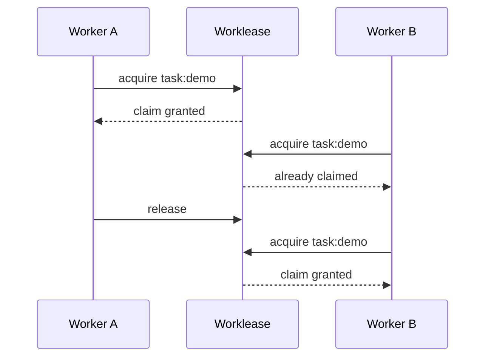
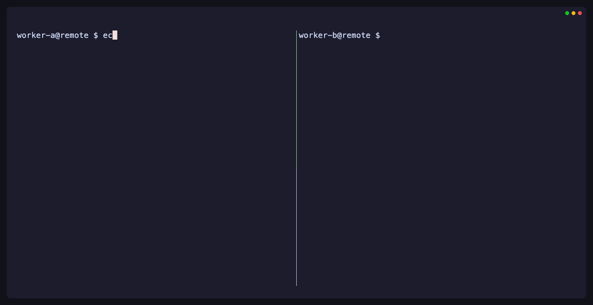

# worklease

[](https://github.com/brettinternet/worklease/actions/workflows/ci.yml)

Provider-neutral coordination for humans and coding agents. 
Tell your agents to claim work with `worklease` to prevent them from
working on top of each other or competing for the same resources and tasks.
Compatible with whatever backlog or provider you're using.


Tell each agent to claim work before starting and release it when done:


```mermaid
sequenceDiagram
    participant A as Worker A
    participant W as Worklease
    participant B as Worker B
    A->>W: acquire task:demo
    W-->>A: claim granted
    B->>W: acquire task:demo
    W-->>B: already claimed
    A->>W: release
    B->>W: acquire task:demo
    W-->>B: claim granted
```

## Worklease or a lockfile?

| Choose | When |
| --- | --- |
| A lockfile | Processes on one host need a critical section. You do not need lease ownership, expiry, history, or recovery. |
| Worklease | Independent workers claim tasks or resources and need TTLs, waiting, status, history, guarded commands, or recovery. Use the local authority on one host or a remote authority across hosts. |

Both coordinate cooperating workers. Neither stops arbitrary external work.

## Install

Install the latest release with mise:

```toml
[tools]
"github:brettinternet/worklease" = "latest"
```

```sh
mise install
worklease version
```

Or build from source with Go 1.27.1:

```sh
mise run build
./bin/worklease version
```

Release archives are named `worklease-vVERSION-{linux,macos}-{x64,arm64}.tar.gz`
and contain `bin/worklease` and `share/man/man1/worklease.1`. Checksums are in
`checksums.txt`. Linux amd64 and arm64 server images are published to
`ghcr.io/brettinternet/worklease:vVERSION`; see [container deployment](docs/container.md).

### Shell completion

Add the matching line to your shell configuration:

```bash
# ~/.bashrc
source <(worklease completion bash)
```

```zsh
# ~/.zshrc
source <(worklease completion zsh)
```

For Fish, generate its conventional completion file:

```fish
mkdir -p ~/.config/fish/completions
worklease completion fish > ~/.config/fish/completions/worklease.fish
```

Restart the shell or source its configuration after installing Worklease.

## Quick start

Claim a resource, do the work, then release it:

<!-- worklease-example:run quick-start -->
```sh
worklease acquire -r task:demo
# do the work
worklease release
```
<!-- worklease-example:end -->

Add a stable session, TTL, wait, guarded command, and release reason as needed:

```sh
# Claim for 20 minutes; wait up to 2 minutes if busy.
worklease acquire -r task:demo -s loop-a -t 20m -w 2m
# Run only while loop-a holds the claim.
worklease exec -s loop-a -- worklease version
worklease release -s loop-a -m done
```

Claims live in an owner-private local SQLite authority. Each session has a
private, authority-bound handle. Use a different `-s` for each concurrent loop
in one checkout. Credentials are never printed.

Worklease exposes non-secret claimant metadata:

- `agentId` — the claimant identity
- `sessionId` — the agent loop/session
- `workKey` — what it says it’s working on
- `claimId` and expiry

See the [CLI reference](docs/cli-reference.md) for provider, credential, replay,
polling, coordination-only, and guarded-operation options.

## Remote authority

Start the secure local authority in one terminal:

```sh
worklease server init
worklease serve
```

`server init` creates TLS for `https://127.0.0.1:8443`, admits
`coordination:`, and prints the owner-private bootstrap artifact path and next
commands. Transfer that artifact through an authenticated secret channel. On
the administrator machine, enroll and issue the second invite:

```sh
worklease enroll --invite-file PATH_PRINTED_BY_INIT
worklease invite issue
```

Bare `worklease enroll` provides a hidden terminal prompt instead. Transfer the
artifact path printed by `invite issue` to the second client, then run:

```sh
worklease enroll --invite-file PATH_PRINTED_BY_INVITE_ISSUE
worklease acquire --resource coordination:demo
worklease list
worklease heartbeat
worklease release
```

Invite artifacts and installation credentials are bearer secrets. Keep them
outside source checkouts and logs, and remove one-time artifacts under your
secret-retention policy.

### Remote

To expose the authority directly on a remote host, provide one explicit
exposure consent and a client-reachable endpoint. Wildcard listeners are never
advertised to clients:

```sh
worklease server init \
  --listen 0.0.0.0:8443 \
  --endpoint https://HOST:8443 \
  --confirm-non-loopback
worklease serve
```

### Customize

Override the local defaults only when needed. Use `--admitted-prefix`,
`--tls-cert` with `--tls-key`, `--bootstrap-invite-file`, or `--server-config`;
then `WORKLEASE_SERVER_CONFIG`; then the matching `server.yaml` keys for a
managed deployment. `--guided` is a no-op compatibility alias. Cleartext also
requires `--transport http --acknowledge-cleartext-credentials`.



`serve` owns one namespace and one SQLite writer. Guarded commands and provider
effects still run on clients. The standard binary opens no listener and makes
no network request unless remote operation is explicit. Local reads remain
setup-free. Remote failures do not fall back to local coordination. This feature
is experimental: it provides no high availability, provider fencing, or
exactly-once execution. See the [remote authority guide](docs/remote-claim-authority.md)
for the explicitly insecure test path, advanced profile management,
administration, and recovery.

## JSON and MCP quick start

Put `--json` before the command for one schema-version 2 envelope. Errors have a
stable `reason`, `exitCode`, and `details`. Contention is a structured outcome,
not a parsing failure.

<!-- worklease-example:run json-two-loops -->
```sh
worklease --json acquire --resource loop-a --session loop-a
worklease --json acquire --resource loop-b --session loop-b
worklease --json status --session loop-a
worklease --json status --session loop-b
worklease --json release --session loop-a --reason done
worklease --json release --session loop-b --reason done
```
<!-- worklease-example:end -->

Contention example:

```sh
worklease --json acquire --resource shared --session contender-a
worklease --json acquire --resource shared --session contender-b
# exits 2 with error.reason "already-claimed" and holder metadata, never a token
worklease --json release --session contender-a --reason done
```

Run the stdio server:

<!-- worklease-example:run mcp-discovery -->
```sh
printf '%s\n' \
  '{"jsonrpc":"2.0","id":1,"method":"server/discover"}' \
  '{"jsonrpc":"2.0","id":2,"method":"tools/list","_meta":{"protocolVersion":"2026-07-28"}}' \
  | worklease mcp
```
<!-- worklease-example:end -->

Handles are private server-side references. MCP intentionally exposes a smaller
surface than the CLI.

For the MCP tool boundary, see [MCP tools](docs/mcp.md).

## Recovery and safety

| Situation | Rule |
| --- | --- |
| New mutation | Omit `--operation-id`. |
| Lost response | Replay the exact request with its operation ID. A changed request conflicts. |
| Started guarded operation | Treat the outcome as unknown until you establish the effect and process cessation, then reconcile it. |
| Expired claim | Ownership ended. An external process may still be running. |
| Copied state | Handles and cursors stay bound to their original authority ID. |

Resources match exact bytes within one authority. Repository and path identities
are host-local.

Credentials come from a private handle, `--token-file`, or `--token-fd`, never
an argv bearer token. Keep them out of output, logs, checkpoints, provider
comments, and handoffs.

See:

- [CLI reference](docs/cli-reference.md)
- [Claim, operation, and recovery model](docs/claim-model.md)
- [MCP and JSON](docs/mcp.md)
- [Setup and native hooks](docs/setup.md)
- [Container deployment](docs/container.md)
- [Remote authority](docs/remote-claim-authority.md)

## Development

```sh
mise run ci
```

`ci` formats, vets, tests, race-tests, scans vulnerabilities, builds the binary,
runs clean-checkout end-to-end smoke, and renders the manual.

## Release process

1. Curate and order `## Unreleased` in `CHANGELOG.md`.
2. Create the dated release section:

   ```sh
   go run ./cmd/worklease-release --version 1.2.0 --prepare-changelog 2026-09-13
   ```

3. Review and commit the new section, then tag that commit as `vVERSION`.
4. Prepare archives with `mise run release -- --version VERSION`.

The changelog command rejects empty entries, invalid versions or dates,
duplicates, and existing releases. The tagged workflow publishes the matching
changelog section verbatim. Tagging and publishing require separate owner
authorization. Experimental remote artifact jobs may build and smoke-test on
matching runners without publishing, tagging, or pushing.
