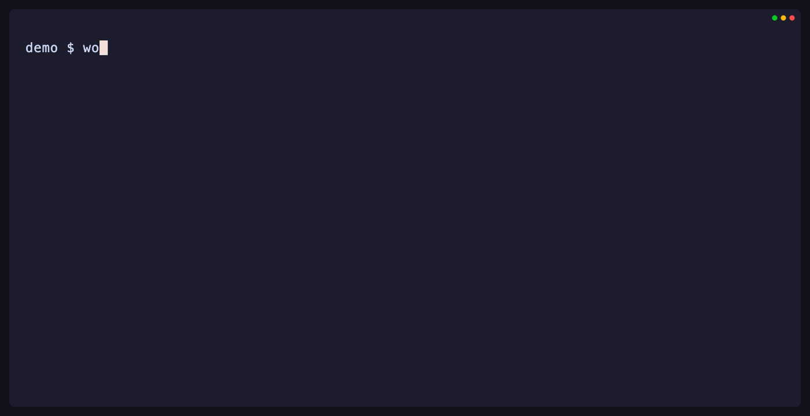
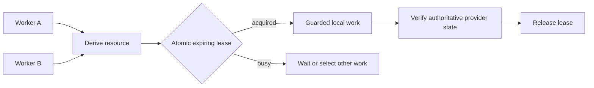

# worklease

Provider-neutral same-host work leases for coordinating humans and agents on one machine.

Worklease prevents duplicate local work. Your external backlog or provider remains authoritative.




```mermaid
flowchart LR
    A[Worker A] --> K[Derive resource]
    B[Worker B] --> K
    K --> L{Atomic expiring lease}
    L -->|acquired| G[Guarded local work]
    L -->|busy| W[Wait or select other work]
    G --> V[Verify authoritative provider state]
    V --> R[Release lease]
```

## Quick start

Source installs require Python 3.14+ and [uv](https://docs.astral.sh/uv/):

```bash
uv tool install .
worklease --version
```

Or install the latest release with [mise](https://mise.jdx.dev/):

```toml
# mise.toml
[tools]
"github:brettinternet/worklease" = "latest"
```

Pin a release by replacing `latest` with a tag such as `vX.Y.Z`. See [GitHub Releases](https://github.com/brettinternet/worklease/releases).

Acquire a lease with the defaults:

```bash
worklease acquire -r my-task -a me
```

## A complete lifecycle

This example coordinates work for `TASK-42` using a private temporary lease handle. The lease file is mode `0600` and is updated after mutations.

```bash
set -euo pipefail
umask 077

export WORKLEASE_AGENT_ID="agent-local-1"

LEASE_DIR="$(mktemp -d "${TMPDIR:-/tmp}/worklease.XXXXXX")"
LEASE_FILE="$LEASE_DIR/task-42.lease"
# Release the lease even if a step below fails, so the resource is not held
# for its full TTL.
trap 'worklease release --lease-file "$LEASE_FILE" --reason aborted 2>/dev/null || true' EXIT
RESOURCE="$(worklease --json key \
  --provider backlog-md \
  --source docs/backlog \
  --item TASK-42 \
  | python3 -c 'import json, sys; print(json.load(sys.stdin)["resource"])')"

worklease acquire \
  --resource "$RESOURCE" \
  --lease-file "$LEASE_FILE" \
  --ttl 900

worklease status --resource "$RESOURCE"

worklease exec \
  --lease-file "$LEASE_FILE" \
  --git-primary \
  --max-duration 3600 \
  -- python3 -c 'print("guarded work")'

worklease checkpoint \
  --lease-file "$LEASE_FILE" \
  --checkpoint '{"status":"tests-passed","item":"TASK-42"}'

# Verify TASK-42 in the authoritative provider before releasing.
worklease release \
  --lease-file "$LEASE_FILE" \
  --reason "provider checkpoint verified"
trap - EXIT
```

Keep the lease handle private. Do not place Worklease state in a repository path shared by linked worktrees.

## Guarded execution duration

`exec` and `exec-bundle` bound child runtime and inherited-pipe draining with
`--max-duration`, which defaults to `3600` seconds and must be finite, greater
than zero, and representable by the host timer. On expiry Worklease terminates the child's process group, records the
operation as completed with reason `child-process-timeout`, and exits `124`.

A grandchild that inherits stdout or stderr can keep pipe draining active after
the direct child exits. The same deadline still applies. A grandchild that
escapes the process group may survive; Worklease stops draining at the deadline,
so captured output may be truncated.

## Heartbeats and contention

Renew long-running work before the TTL expires:

```bash
worklease heartbeat --lease-file "$LEASE_FILE" --ttl 900
```

Lease expiry uses the system wall clock because timestamps persist across
processes. A lease is expired once the clock passes its expiry, so a forward
clock jump can expire a lease immediately; synchronize the host clock and stop
and reacquire after significant clock adjustments.

A backward clock step never strips a live lease from its holder. It does inflate
the stored expiry, so the next contender re-anchors the lease to the corrected
clock instead of waiting for the clock to catch up. An abandoned lease is
therefore reclaimable within one TTL of the first contention rather than after
the full size of the clock step.

For contention, wait briefly instead of failing immediately:

```bash
worklease acquire \
  --resource "$RESOURCE" \
  --lease-file "$LEASE_FILE" \
  --ttl 900 \
  --wait-timeout 30
```

## How it works

A worker derives a stable resource key from an item, source, or other work identity. It atomically acquires an expiring lease, performs guarded local operations, records checkpoints, and releases the lease.

The lease is coordination state on the host. The provider still decides whether work exists, is complete, or should be retried.

### Guarantees and boundaries

- Duplicate local work can be avoided when workers use the same resource.
- Leases expire unless renewed.
- Mutating lease operations update the lease file.
- Guarded commands run only while the lease is held.
- Worklease does not replace provider-side locking, transactions, or conflict checks.

Use `--coordination-only` when provider writes happen outside a Worklease-guarded local operation. Coordination-only claims are explicitly non-fencing.

If a command has an unknown outcome, inspect it with `inspect-operation`, verify the authoritative external result, then use `reconcile-operation`. Do not automatically rerun it.

See the [claim model](docs/claim-model.md) for the coordination model and failure semantics, and the [CLI reference](docs/cli-reference.md) for exit codes, the short option namespace, state selection, garbage-collection semantics, and the text output grammar.

## Providers and resources

Resource providers include `backlog-md`, `github`, `linear`, `markdown`, and `generic`.

```bash
worklease key \
  --provider backlog-md \
  --source docs/backlog \
  --item TASK-42
```

The resulting resource is suitable for `acquire`, `status`, `exec`, and related commands.

## Bundles

Use a bundle when one operation needs several resources together. Bundles contain 1 to 32 ordered resources and acquire them atomically, all or nothing.

```bash
worklease acquire-bundle \
  --resource "$RESOURCE_A" \
  --resource "$RESOURCE_B" \
  --lease-file "$LEASE_FILE" \
  --ttl 900

worklease heartbeat-bundle --lease-file "$LEASE_FILE" --ttl 900
worklease exec-bundle --lease-file "$LEASE_FILE" -- command --arg
worklease release-bundle \
  --lease-file "$LEASE_FILE" \
  --reason "provider checkpoint verified"
```

Use the same exact resource order throughout the bundle lifecycle. Bundles coordinate local work only. They do not fence provider writes.

## Agent workflow

Tell your agent to read [skills/AGENTS.md](skills/AGENTS.md) and install the complete [`skills/worklease-workflow`](skills/worklease-workflow/SKILL.md) directory from the same Git tag as the CLI. Installing the skill does not install the CLI.

For example:

```text
Read https://github.com/brettinternet/worklease/blob/vX.Y.Z/skills/AGENTS.md
and install the complete Worklease skill for this agent at tag vX.Y.Z.
```

The workflow contract is in [skills/worklease-workflow/SKILL.md](skills/worklease-workflow/SKILL.md). Provider-specific compatibility notes are in [docs/source-provider-sdk-compatibility.md](docs/source-provider-sdk-compatibility.md).

## Automation and safety

Use JSON when another program consumes the result:

```bash
worklease status --resource "$RESOURCE" --json
worklease status --resource "$RESOURCE" --format json
```

`--json` and `--format json` provide the schema-versioned JSON contract. Default output is human-readable text. Run `worklease COMMAND --help` or `worklease --help-all` for complete command details.

Exit code `2` reports lease or capability conflicts. Guarded commands otherwise return the child status; `child-process-timeout` returns `124`. `stale-claim` means the claim ID no longer owns the resource; `invalid-token` means the claim ID is current but its supplied bearer token is invalid. Reload the credential and revalidate ownership before retrying `invalid-token`; stop mutating under `stale-claim`. Neither response exposes token material.

Prefer lease files, token files, or file descriptors for bearer tokens. Never log tokens. Passing `--token` exposes the token in process arguments.

State directory precedence is:

1. `--home`
2. `WORKLEASE_HOME`
3. `XDG_STATE_HOME/worklease`
4. `~/.local/state/worklease`

Avoid repository-relative state, especially across linked worktrees.
