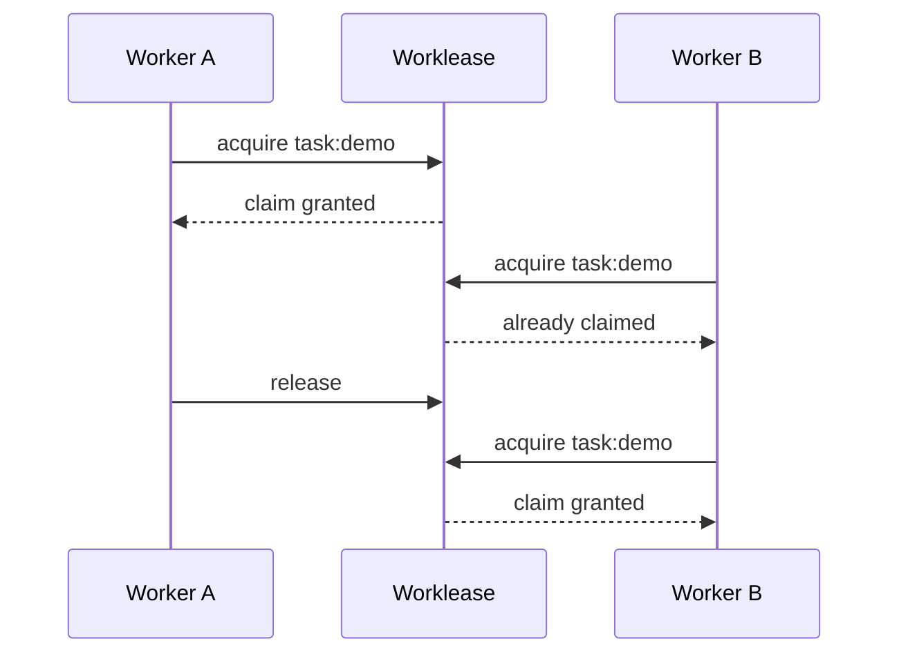

# worklease

Provider-neutral, same-host coordination for humans and coding agents.
Worklease prevents cooperating local loops from duplicating work. Your backlog
or provider remains authoritative.


Or just tell your team of agents to claim work with `worklease` to prevent them
from competing for the same tasks.


```mermaid
sequenceDiagram
    participant A as Worker A
    participant W as Worklease
    participant B as Worker B
    A->>W: acquire task:demo
    W-->>A: claim granted
    B->>W: acquire task:demo
    W-->>B: already claimed
    A->>W: release
    B->>W: acquire task:demo
    W-->>B: claim granted
```

## Install

Install the latest release with mise:

```toml
[tools]
"github:brettinternet/worklease" = "latest"
```

```sh
mise install
worklease version
```

Or build from source with Go 1.27.1:

```sh
mise run build
./bin/worklease version
```

Release archives are named `worklease-vVERSION-{linux,macos}-{x64,arm64}.tar.gz`
and contain `bin/worklease` and `share/man/man1/worklease.1`. Checksums are in
`checksums.txt`.

## Quick start

Claim a resource, do the work, then release it:

<!-- worklease-example:run quick-start -->
```sh
worklease acquire -r task:demo
# do the work
worklease release
```
<!-- worklease-example:end -->

For a moderately advanced workflow, use a stable session to isolate this loop,
wait briefly for a busy resource, run a guarded command, and record why the
claim was released:

```sh
worklease acquire -r task:demo -s loop-a -t 20m -w 2m
worklease exec -s loop-a -- worklease version
worklease release -s loop-a -m done
```

Commands use an owner-private local SQLite authority. A stable session selector
keeps concurrent loops in the same checkout from overwriting each other's
handles. A contextual handle carries the claim ID, revision, authority ID, and
private credential; output never carries the token.

The complete short-option namespace is intentionally small and optimized for
routine workflows:

| Short | Long | Short | Long |
| --- | --- | --- | --- |
| `-j` | `--json` | `-H` | `--home` |
| `-h` | `--help` | `-v` | `--version` |
| `-r` | `--resource` | `-s` | `--session` |
| `-t` | `--ttl` | `-w` | `--wait` |
| `-a` | `--agent` | `-f` | `--full` |
| `-m` | `--reason` | | |

Each alias is available wherever its long option is supported. All other
options are long-only, including `--source`, `--work-key`, provider inputs,
explicit credentials, replay controls, polling controls, coordination-only
mode, and guarded-operation tuning. Use `--path FILE` to derive exact
repository/path membership. Native hooks confirm only a current claim by
default; generate them with `--coverage path`
to require every edited path. A direct `verify --resource RESOURCE` checks exact
membership. Only expected-hash `replace-file` reports
`mutationProtection: local-serialized-replace`; `exec` and provider calls remain
`guarantee: local-coordination`.

## JSON and MCP quick start

Put `--json` before the command for one schema-version 2 envelope. Domain errors
retain a stable `reason`, `exitCode`, and machine-readable `details`; contention
is a normal structured outcome, not a parsing failure.

<!-- worklease-example:run json-two-loops -->
```sh
worklease --json acquire --resource loop-a --session loop-a
worklease --json acquire --resource loop-b --session loop-b
worklease --json status --session loop-a
worklease --json status --session loop-b
worklease --json release --session loop-a --reason done
worklease --json release --session loop-b --reason done
```
<!-- worklease-example:end -->

Contention example:

```sh
worklease --json acquire --resource shared --session contender-a
worklease --json acquire --resource shared --session contender-b
# exits 2 with error.reason "already-claimed" and holder metadata, never a token
worklease --json release --session contender-a --reason done
```

Run the stdio server:

<!-- worklease-example:run mcp-discovery -->
```sh
printf '%s\n' \
  '{"jsonrpc":"2.0","id":1,"method":"server/discover"}' \
  '{"jsonrpc":"2.0","id":2,"method":"tools/list","_meta":{"protocolVersion":"2026-07-28"}}' \
  | worklease mcp
```
<!-- worklease-example:end -->

Handles are private server-side references. MCP intentionally exposes a smaller
surface than the CLI.

For the MCP tool boundary, see [MCP tools](docs/mcp.md).

## Recovery and safety

Every mutation has an exact request and operation ID. Omit `--operation-id` for
a fresh action. Supply one only to replay that same request after a lost
response. A changed request conflicts. Started guarded operations have unknown
outcomes until the authoritative effect and process cessation are established;
inspect and reconcile them explicitly before continuing.

Resources contend by exact bytes in one authority namespace. Local repository
and path identities are host-local. Handles and event/watch cursors are bound to
an immutable authority ID, so copied state cannot silently authorize another
authority. Expiry ends ownership but does not prove an external process stopped.

Credentials may come from a private handle, `--token-file`, or `--token-fd`.
There is no argv bearer-token option. Never put credentials in output, logs,
checkpoints, provider comments, or handoffs.

See:

- [CLI reference](docs/cli-reference.md)
- [Claim, operation, and recovery model](docs/claim-model.md)
- [MCP and JSON](docs/mcp.md)
- [Setup and native hooks](docs/setup.md)
- [Deferred remote-authority proposal](docs/distributed-cloudflare-claim-authority.md)

## Development

```sh
mise run ci
```

`ci` formats, vets, tests, race-tests, scans vulnerabilities, builds the binary,
runs clean-checkout end-to-end smoke, and renders the manual.

## Release process

Curate entries under `## Unreleased` in `CHANGELOG.md`, grouped and ordered as
they should appear in the release. Promote those entries mechanically before
committing and tagging the release:

```sh
go run ./cmd/worklease-release --version 1.2.0 --prepare-changelog 2026-09-13
```

This rejects an empty Unreleased section, invalid versions or dates, duplicate
versions, and an existing target release. Review and commit the resulting fresh
empty Unreleased section and dated version section, then tag that commit as
`vVERSION`. The tagged release workflow requires exactly one matching non-empty
changelog section and publishes its body verbatim instead of generating notes
from commits. Archive preparation still uses:

```sh
mise run release -- --version VERSION
```

Tagging and publishing need separate owner authorization.
