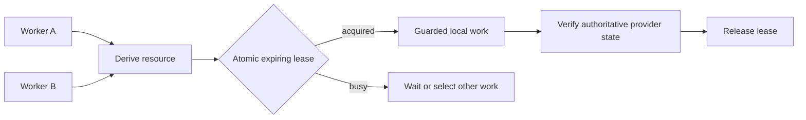

# worklease

Provider-neutral same-host work leases for coordinating humans and agents on one machine.

Worklease prevents duplicate local work. Your external backlog or provider remains authoritative.



```mermaid
flowchart LR
    A[Worker A] --> K[Derive resource]
    B[Worker B] --> K
    K --> L{Atomic expiring lease}
    L -->|acquired| G[Guarded local work]
    L -->|busy| W[Wait or select other work]
    G --> V[Verify authoritative provider state]
    V --> R[Release lease]
```

## Quick start

Source installs require Python 3.14+ and [uv](https://docs.astral.sh/uv/):

```bash
uv tool install .
worklease --version
```

Or install the latest release with [mise](https://mise.jdx.dev/):

```toml
# mise.toml
[tools]
"github:brettinternet/worklease" = "latest"
```

Pin a release by replacing `latest` with a tag such as `vX.Y.Z`. See [GitHub Releases](https://github.com/brettinternet/worklease/releases). Each release publishes a version-matched `worklease.1` manual and changelog; native archives also contain the manual at `share/man/man1/worklease.1`.

Acquire a lease with the defaults:

```bash
worklease acquire -r my-task -a me
```

## A complete lifecycle

This example coordinates work for `TASK-42` using a private temporary lease handle. The lease file is mode `0600` and is updated after mutations.

```bash
set -euo pipefail
umask 077

export WORKLEASE_AGENT_ID="agent-local-1"

LEASE_DIR="$(mktemp -d "${TMPDIR:-/tmp}/worklease.XXXXXX")"
LEASE_FILE="$LEASE_DIR/task-42.lease"
# Release the lease even if a step below fails, so the resource is not held
# for its full TTL.
trap 'worklease release --lease-file "$LEASE_FILE" --reason aborted 2>/dev/null || true' EXIT
RESOURCE="$(worklease --json key \
  --provider backlog-md \
  --source docs/backlog \
  --item TASK-42 \
  | python3 -c 'import json, sys; print(json.load(sys.stdin)["resource"])')"

worklease acquire \
  --resource "$RESOURCE" \
  --lease-file "$LEASE_FILE" \
  --ttl 900

worklease status --resource "$RESOURCE"

worklease exec \
  --lease-file "$LEASE_FILE" \
  --git-primary \
  --max-duration 3600 \
  -- python3 -c 'print("guarded work")'

worklease checkpoint \
  --lease-file "$LEASE_FILE" \
  --checkpoint '{"status":"tests-passed","item":"TASK-42"}'

# Verify TASK-42 in the authoritative provider before releasing.
worklease release \
  --lease-file "$LEASE_FILE" \
  --reason "provider checkpoint verified"
trap - EXIT
```

Keep the lease handle private. Do not place Worklease state in a repository path shared by linked worktrees.

## Guarded execution duration

`exec` and `exec-bundle` require a finite `--max-duration` greater than zero
and representable by the host timer. The default is `3600` seconds.

The deadline covers both the child runtime and inherited-pipe draining. When it
expires, Worklease terminates the child's process group, records
`child-process-timeout`, and exits `124`.

After the child starts, `exec` returns the child's exit status unless the
deadline expires. A grandchild that escapes the process group may survive.
Worklease stops draining at the deadline, so captured stdout or stderr may be
truncated.

## Heartbeats and contention

Renew long-running work before the TTL expires:

```bash
worklease heartbeat --lease-file "$LEASE_FILE" --ttl 900
```

Lease expiry uses the system wall clock:

- A forward clock jump can expire a lease immediately.
- A backward step does not remove a live lease.
- After a backward step, the next contender re-anchors the stored expiry.
- An abandoned lease is reclaimable within one TTL after contention.

Synchronize the host clock. After a significant adjustment, stop and reacquire
the lease.

For contention, wait briefly instead of failing immediately:

```bash
worklease acquire \
  --resource "$RESOURCE" \
  --lease-file "$LEASE_FILE" \
  --ttl 900 \
  --wait-timeout 30
```

## Why not a lock file?

A simple sentinel file can signal that work is claimed, but it does not by itself provide safe ownership or recovery. A correctly implemented OS-backed lock may be all you need for local mutual exclusion. Worklease is a higher-level, same-host coordination protocol. Candidly, it uses OS locking internally.

Worklease adds:

- Expiring, recoverable ownership through TTLs and heartbeats.
- Named, inspectable ownership epochs with claim IDs, tokens, and revisions; stale owners are rejected.
- Guarded, bounded execution.
- Atomic bundles for related changes.
- Checkpoints, retention-bounded coordination history, and reconciliation for unknown outcomes.

Use a lock when mutual exclusion is sufficient. Use Worklease when work needs expiring ownership, stale-owner protection, bounded execution, coordinated updates, or recovery checkpoints (e.g. agentic loops).

Neither a local lock nor Worklease fences writes made directly to an external provider; provider-side concurrency controls are required for that boundary.

## How it works

```text
work identity
    │
    ▼
stable resource key
    │
    ▼
expiring lease ──► guarded local work ──► checkpoint ──► release
```

Workers that derive the same resource key contend for one lease. The lease
coordinates local work only. The external provider remains authoritative for
eligibility, progress, completion, and retries.

### Guarantees and boundaries

- Duplicate local work can be avoided when workers use the same resource.
- Leases expire unless renewed.
- Mutating lease operations update the lease file.
- Guarded commands run only while the lease is held.
- Worklease does not replace provider-side locking, transactions, or conflict checks.

Use `--coordination-only` when provider writes happen outside a Worklease-guarded local operation. Coordination-only claims are explicitly non-fencing.

If a command has an unknown outcome, inspect it with `inspect-operation`, verify the authoritative external result, then use `reconcile-operation`. Do not automatically rerun it.

See the [claim model](docs/claim-model.md) for the coordination model and failure semantics, and the [CLI reference](docs/cli-reference.md) for exit codes, the short option namespace, state selection, garbage-collection semantics, and the text output grammar.

## Providers and resources

Resource providers include `backlog-md`, `github`, `linear`, `markdown`, and `generic`.

```bash
worklease key \
  --provider backlog-md \
  --source docs/backlog \
  --item TASK-42
```

The resulting resource is suitable for `acquire`, `status`, `exec`, and related commands.

## Bundles

Use a bundle when one operation needs several resources together. Bundles contain 1 to 32 ordered resources and acquire them atomically, all or nothing.

```bash
worklease acquire-bundle \
  --resource "$RESOURCE_A" \
  --resource "$RESOURCE_B" \
  --lease-file "$LEASE_FILE" \
  --ttl 900

worklease heartbeat-bundle --lease-file "$LEASE_FILE" --ttl 900
worklease exec-bundle --lease-file "$LEASE_FILE" -- command --arg
worklease release-bundle \
  --lease-file "$LEASE_FILE" \
  --reason "provider checkpoint verified"
```

Use the same exact resource order throughout the bundle lifecycle. Bundles coordinate local work only. They do not fence provider writes.

## Agent discovery

For lightweight use, add this to the project's `AGENTS.md` or equivalent:

```md
## Multi-agent coordination
When agents may touch the same work item, use `worklease`.
Run `worklease instructions loop` before coordinating.
Claims coordinate cooperating workers only; the backing task system remains authoritative.
```

For a Ralph loop or other multi-agent worker prompt, the CLI supplies concise, version-matched instructions:

```text
Before editing, run `worklease instructions loop` and follow it.
All workers must use the same Worklease authority and derive the same exact resource.
On claim conflict, wait or select other ready work; never edit without the claim.
```

Use `worklease instructions safety` for the trust, fencing, credential, and recovery boundaries. These commands are the smallest useful integration and can be loaded only when coordination is needed.

Install the complete [`skills/worklease-workflow`](skills/worklease-workflow/SKILL.md) directory only for dependency-aware selection, provider mappings, handoffs, review, or archive workflows. Tell an agent to read [skills/AGENTS.md](skills/AGENTS.md) and install the skill from the same Git tag as the CLI; installing the skill does not install the CLI. Provider compatibility notes are in [docs/source-provider-sdk-compatibility.md](docs/source-provider-sdk-compatibility.md).

## Automation and safety

Use JSON when another program consumes the result:

```bash
worklease status --resource "$RESOURCE" --json
worklease status --resource "$RESOURCE" --format json
```

`--json` and `--format json` provide the schema-versioned JSON contract. Default output is human-readable text. Run `worklease COMMAND --help` or `worklease --help-all` for complete command details.

| Result | Meaning | Action |
| --- | --- | --- |
| Exit `2` | Lease or capability conflict | Check the stable reason |
| Child exit status | Guarded command completed | Handle the child result |
| Exit `124` | `child-process-timeout` | Inspect the timed-out operation |
| `stale-claim` | The claim ID no longer owns the resource | Stop mutating |
| `invalid-token` | The claim is current, but the token is wrong | Reload the credential and revalidate ownership |

Conflict responses never expose token material.

Prefer lease files, token files, or file descriptors for bearer tokens. Never log tokens. Passing `--token` exposes the token in process arguments.

State directory precedence is:

1. `--home`
2. `WORKLEASE_HOME`
3. `XDG_STATE_HOME/worklease`
4. `~/.local/state/worklease`

Avoid repository-relative state, especially across linked worktrees.

## Optional MCP server

Coding agents can install the local stdio MCP interface with the `mcp` extra.
It exposes only the seven typed lifecycle tools and keeps bearer tokens in
private persisted handles. See [the MCP guide](docs/mcp.md) for Claude Code
configuration, safe lifecycle and operator recovery.
