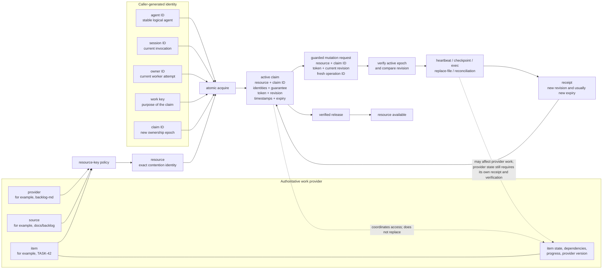
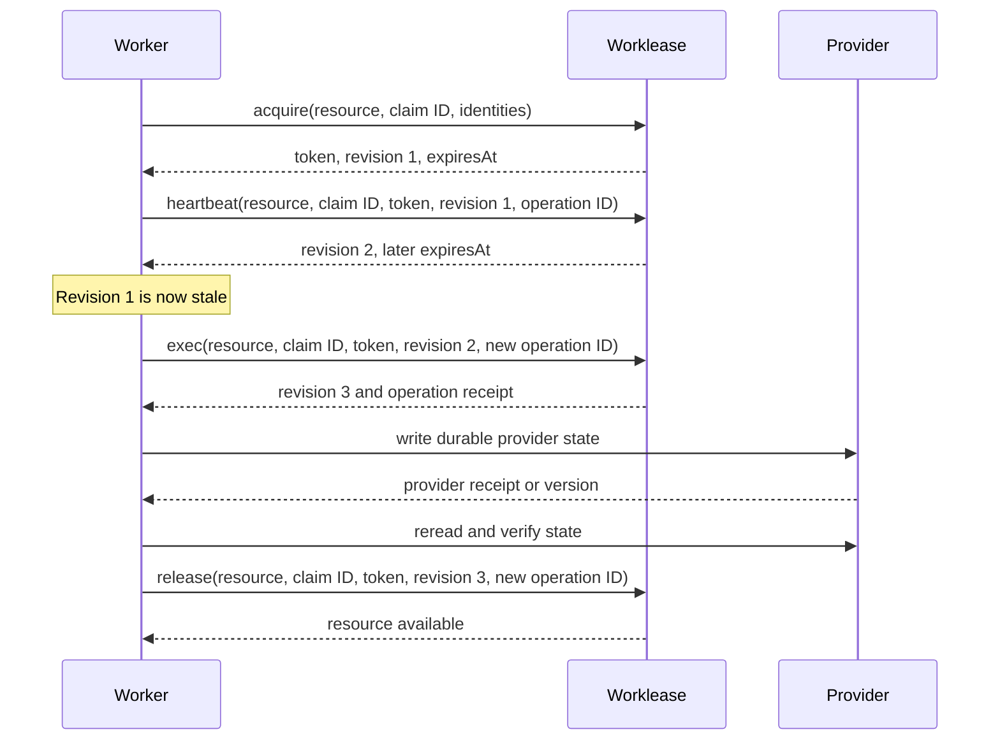
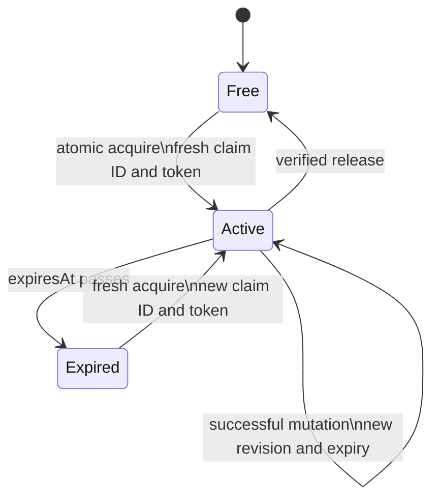

# Worklease claim model

Worklease is a local ownership coordinator. It does not own a backlog item or
its workflow state. It grants one worker a bounded ownership epoch over an
opaque resource, then checks that ownership before guarded local operations.

The shortest useful model is:

```text
provider + source + item -> resource -> claim -> guarded operations
```

- The **item** is provider work.
- The **resource** is the exact value contenders coordinate on.
- The **claim** is one temporary ownership epoch for that resource.
- The **provider** remains authoritative for item state and progress.

## Entity relationships



`provider`, `source`, and `item` are inputs to resource derivation. The
Worklease core receives the resulting resource as an opaque string and does
not infer provider behavior from it.

Every contender for the same protected unit must derive the same resource
byte-for-byte. A transient value such as agent, process, worktree, or session
identity must not be part of the resource: doing so would give each contender
a different lock instead of making them contend.

## What each value does

| Value | Meaning | Why it exists |
| --- | --- | --- |
| `provider` | Resource-key policy name, such as `backlog-md` | Selects deterministic resource derivation; it does not make provider calls |
| `source` | Stable provider collection or location | Separates identically named items in different sources |
| `item` | Provider-local work identity, such as `TASK-42` | Identifies the work within its source |
| `resource` | Exact opaque contention key | Makes cooperating callers contend on the same protected unit |
| `claim ID` | Globally unique ownership-epoch ID | Distinguishes this attempt from every previous or future owner |
| `agent ID` | Stable, caller-visible logical agent identity | Makes ownership diagnostics understandable; it does not authorize mutations |
| `session ID` | Current invocation or session identity | Distinguishes separate runs of an agent |
| `owner ID` | Unique worker-attempt identity | Distinguishes retries or concurrent workers within an agent/session |
| `work key` | Caller-defined purpose, such as `implement:TASK-42` | Explains what the owner intends to do; it is not the contention key |
| `token` | Secret bearer credential returned by acquisition | Proves possession of the ownership epoch |
| `token file` | Recommended mode-0600 transport for the token | Keeps the token out of argv; it is not a separate claim entity |
| `revision` | Monotonic claim-authority compare-and-set value | Rejects a worker using stale claim state |
| `operation ID` | Idempotency key for one exact mutation request | Recovers a lost response without accidentally executing changed intent |
| `TTL` | Requested bounded lease lifetime | Ensures abandoned ownership eventually ends |
| `expiresAt` | Authority-generated deadline | Determines when the claim stops being active |
| `operation` | Command/result kind, such as `acquire` or `heartbeat` | Describes what a request or receipt represents; it is not the operation ID |
| `guarantee` | `fenced` or `local-coordination` | States the exact protection Worklease can prove |
| `checkpoint` | Optional bounded local recovery metadata | Helps a successor resume; it is not authoritative provider progress |
| provider version | Provider-side version, hash, or conditional-write value | Detects changes to authoritative work independently of the claim revision |

The identifiers deliberately overlap in human meaning but not in safety role:

```text
agent ID   = which logical agent?
session ID = which invocation?
owner ID   = which worker attempt?
claim ID   = which ownership epoch?
work key   = doing what?
resource   = contending over what?
```

Matching an agent, session, owner, or work key never authorizes adoption of an
existing claim. Only the exact active claim ID, bearer token, and current
revision authorize its next mutation.

## Required values by operation

“Required” below means required by that claim-related CLI path. Defaults and
operation-specific payloads are shown separately. Canonical bundle aliases such
as `bundle-acquire` accept the same inputs as the displayed command name.

| Operation | Required identity and authorization | Additional input |
| --- | --- | --- |
| `key` | `provider`, `source`, `item` | Optional `--coordination-only` |
| `acquire` | `resource`, fresh `claim ID`, `agent ID`, fresh `session ID`, fresh `owner ID`, `work key` | TTL defaults to 900 seconds; optional `--coordination-only` |
| `status` | `resource` | No token; read-only output is redacted |
| `list` | None | Optional resource filter |
| `heartbeat` | `resource`, `claim ID`, token credential, current `revision`, fresh `operation ID` | Renewal TTL defaults to 900 seconds |
| `checkpoint` | Same claim mutation fields as heartbeat | JSON checkpoint; renewal TTL defaults to 900 seconds |
| `exec` | Same claim mutation fields as heartbeat | Command argv; optional execution-directory selection |
| `replace-file` | Same claim mutation fields as heartbeat | Path, content file, and expected SHA-256 are always required |
| `transfer` | Same claim mutation fields as heartbeat | Fresh successor claim, agent, session, owner, and work-key identities |
| `release` | `resource`, `claim ID`, token credential, current `revision`, fresh `operation ID` | Nonblank audit reason; no renewal TTL |
| `inspect-operation` | `resource`, `operation ID` | No token; read-only inspection |
| `reconcile-operation` | Same claim mutation fields as heartbeat | Target operation ID, expected request SHA-256, observed outcome, and evidence |
| `acquire-bundle` | Ordered `resource` values, fresh `claim ID`, `agent ID`, fresh `session ID`, fresh `owner ID`, `work key` | 1–32 unique resources; TTL defaults to 900 seconds; optional `--coordination-only` |
| `status-bundle` | Exact ordered `resource` values | No token; order must match acquisition |
| `heartbeat-bundle` | Exact ordered `resource` values, bundle `claim ID`, token credential, current bundle `revision`, fresh `operation ID` | Renewal TTL defaults to 900 seconds |
| `exec-bundle` | Same bundle mutation fields as heartbeat-bundle | Command argv; optional execution-directory selection |
| `release-bundle` | Exact ordered `resource` values, bundle `claim ID`, token credential, current bundle `revision`, fresh `operation ID` | Nonblank audit reason; no renewal TTL |
| `inspect-operation-bundle` | Exact ordered `resource` values, `operation ID` | No token; read-only inspection |
| `reconcile-operation-bundle` | Same bundle mutation fields as heartbeat-bundle | Target operation ID, expected request SHA-256, observed outcome, and evidence |

A token credential is required for each claim mutation, but `--token-file` is
only one transport. Supply exactly one of `--token`, `--token-file`, or
`--token-fd`. Prefer a mode-0600 token file or inherited file descriptor so the
secret does not appear in argv. Never place the token in logs, provider
comments, checkpoints, diagnostics, examples, or handoffs.

Bundle commands use one bundle claim over an exact ordered set of 1–32
resources. Status, mutation, operation inspection, and reconciliation must
repeat the resources in acquisition order. Bundle acquisition, reconciliation,
and revision changes are all-or-nothing.

## Lifecycle and mutation checks



The token answers “do you possess this ownership epoch?” The revision answers
“are you acting on its latest state?” The operation ID answers “is this the
same exact request being retried?”

Every successful claim mutation advances the revision. Replace the held value
with the returned revision. Reusing an older value must fail even when the
claim ID and token are otherwise correct.

An operation ID is not a general correlation ID. Reuse it only to recover the
same request after a lost response. Changed inputs—including TTL, command,
checkpoint, or release reason—require a new operation ID.

## Expiry and recovery



`active` is derived from the authority clock: the claim is active while the
current time is before `expiresAt`. A heartbeat should occur before half the
lease elapses and around long operations. Expiry permits a new ownership epoch;
it does not permit a successor to adopt the old claim ID or token.

## Three meanings of state

“State” appears at three different boundaries:

| State | Authority | Examples |
| --- | --- | --- |
| Provider item state | Backlog.md, GitHub, Linear, or another work source | todo, in progress, blocked, done |
| Resource/claim state | Worklease | free, active, expired |
| Operation outcome state | Worklease operation history | completed, unknown-outcome, reconciled |

Provider state determines whether work is eligible and whether progress is
durable. Claim state determines whether a local caller currently owns the
resource. Operation state records whether Worklease can establish the outcome
of a guarded request. None substitutes for another.

## Claim revision versus provider version

These values protect different authorities:

```text
claim ID + token + claim revision
                 AND
provider eligibility + provider version
```

The **claim revision** changes when Worklease successfully heartbeats,
checkpoints, executes, transfers, reconciles, or otherwise mutates the claim.
It detects stale claim holders.

The **provider version** changes when authoritative work changes. Depending on
the provider, it might be a file SHA-256, version number, update marker, or
conditional-write token. It detects stale provider reads.

A local claim does not automatically fence a remote provider mutation. For a
direct Backlog.md, GitHub, Linear, or other provider write, use
`local-coordination`, refresh claim ownership and provider eligibility before
the write, retain the provider receipt, and reread both afterward. Report
provider fencing only when the provider mutation itself conditionally rejects
stale writers and returns evidence.

## Sources of truth

- The [generic coordination contract](../skills/worklease-workflow/references/contract.md)
  is normative for scheduling, claims, mutation sequencing, and guarantees.
- The [Worklease workflow guide](backlog/docs/worklease-workflow/doc-1%20-%20Worklease-Workflow.md)
  explains how callers apply the contract.
- The [source workflow](../skills/worklease-workflow/references/source-workflow.md)
  maps concrete providers into the provider-neutral contract.
- The [CLI JSON schemas](../src/worklease/schemas/v1/commands.json) define
  released response fields.
