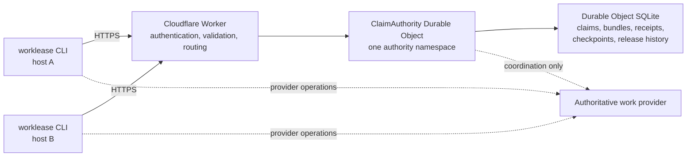

# Distributed Worklease claims on Cloudflare

## Decision

A distributed Worklease claim authority is feasible on Cloudflare.

Use a hybrid design:

- deploy the remote authority as a separate Cloudflare Worker service;
- implement authoritative claim state in a SQLite-backed Durable Object;
- integrate the remote authority as another backend of the existing `worklease`
  CLI;
- keep local SQLite and POSIX coordination as the default backend; and
- keep the work provider authoritative for task content, eligibility, progress,
  review, and completion.

Do not create a second end-user claim CLI. Do not make the Python CLI deploy or
administer Cloudflare in the first version. The service is a separate deployment
artifact, while normal remote claim operations remain part of `worklease`.

The primary reason to use Durable Objects is their globally unique identity and
strongly consistent transactional storage. Cloudflare explicitly positions
Durable Objects for coordination problems where requests for the same object
must be serialized. D1 is useful for globally accessible relational data and
read-heavy workloads, but it is not needed in the correctness boundary for a
lease authority.

## Required guarantee language

A remote lease coordinates cooperating Worklease clients across hosts. It does
not, by itself, fence arbitrary side effects executed by those clients.

Consider this sequence:

```text
client A acquires resource with authority epoch 72
client A starts a provider API request
client A loses connectivity and stops heartbeating
A's lease expires
client B acquires resource with authority epoch 73
A's already-running provider request completes
B's provider request completes
```

The authority behaved correctly: A could not renew after expiry, and B received
a fresh ownership epoch. The authority could not cancel A's local process or
make the provider reject A's late request.

Report guarantees as follows:

| Operation | Guarantee |
| --- | --- |
| Remote acquire, heartbeat, checkpoint, transfer, and release | Cross-host exclusion among cooperating clients using the same authority and exact resource |
| Client-side `worklease exec` under a remote claim | Coordination only; the remote authority cannot terminate an already-running child process |
| Direct Backlog.md, GitHub, Linear, or other provider write | `providerMutationFenced: false` unless that write supplies its own conditional-write evidence |
| Provider write that accepts and enforces a monotonically increasing authority epoch | May be reported as provider-fenced within that exact mutation boundary |
| Mutation executed by an authority-side adapter | Potentially fenced only if the authority defines execution, cancellation, retry, and unknown-outcome semantics for that adapter |

Remote client-side `exec` must therefore normalize to `local-coordination`. A
heartbeat loop and preflight ownership check reduce overlap risk but do not
eliminate the expired-holder race.

The backing provider remains the source of truth. A claim receipt is not a
provider progress receipt, and a successful release reason is not proof that a
provider checkpoint occurred.

## Proposed architecture



### Worker boundary

The Worker is a stateless front door. It should:

1. authenticate the calling installation;
2. resolve the caller's authorized authority namespace from trusted
   authentication state;
3. reject unsupported protocol versions, methods, content types, oversized
   bodies, and unknown fields;
4. route every request for that namespace to the same Durable Object;
5. return schema-versioned JSON with `Cache-Control: no-store`; and
6. redact authority and claim bearer credentials from logs and diagnostics.

The request body may name a namespace for explicitness, but it must not grant
access. Namespace authorization comes from server-owned identity and policy.

### Durable Object boundary

Start with one Durable Object per authority namespace. One object is enough for
a private deployment.

| Design | Bundle behavior | Decision |
| --- | --- | --- |
| One object per namespace | Every member shares one SQLite transaction | Use this first |
| One object per resource | Atomic bundles need distributed transactions or a separate coordinator | Defer until throughput requires it |

The object serializes every claim request in its namespace and stores all rows
in its local SQLite database.

If one object becomes too small:

1. Shard by an explicit tenant, organization, or repository namespace.
2. Keep bundles atomic only within one namespace.
3. Reject cross-namespace bundles before acquiring any member.

SQLite is the only authoritative state. Durable Objects can be evicted while
idle, so in-memory claim state must not outlive a request.

- Evaluate `expires_at` lazily against authority time. No expiry timer is
  needed.
- Use Durable Object Alarms for retention cleanup of operation receipts,
  checkpoints, and release history. Do not sweep on every request.

### D1 boundary

D1 should not participate in acquisition, heartbeat, expiry replacement, or
release decisions. Durable Object storage already supplies the consistency and
transaction boundary those operations require.

D1 may later receive an append-only audit projection for reporting across many
authority namespaces. Projection failure must not change claim correctness. If
D1 read replication is enabled, consumers must use D1 Sessions and commit tokens
where sequential consistency matters.

## Authority data model

The logical model can follow the current local lease model while adding one
cross-epoch fencing value:

```text
resource_state
  resource                 primary key
  next_fence               monotonically increasing across ownership epochs
  retained_checkpoint      optional bounded canonical JSON

active_claim
  resource                 primary key
  claim_id                 globally unique ownership epoch
  token_hash               hash of claim bearer credential
  fence                    proposed cross-epoch fencing value
  revision                 monotonic within this claim
  agent_id
  session_id
  owner_id
  work_key
  acquired_at
  heartbeat_at
  expires_at
  checkpoint               optional bounded canonical JSON

bundle
  claim_id                 primary key
  ordered resources        1-32 exact unique values
  shared token, revision, timestamps, identities, and work key

operation_receipt
  authority namespace
  operation_id
  canonical request hash
  state                    started, completed, or reconciled
  cached response or recovery metadata

release_history
  resource or bundle identity
  released claim identity and fence
  release reason
  retained checkpoint
  released_at
```

`fence` is a proposed extension, not an existing Worklease version-1 schema
field. It must increase across successive claims for a resource. `revision`
continues to protect mutations within one claim. A downstream provider gains no
protection from `fence` unless it records the latest accepted value and rejects
older values.

`fence` is per resource, not per claim. A bundle acquire draws the next fence
from each member's `resource_state` row inside the single acquisition
transaction, and the bundle receipt reports one fence per member resource.
There is no bundle-level fence, because members may have different ownership
histories.

The claim token is a secret bearer credential.

| Requirement | Options or boundary |
| --- | --- |
| Storage | Store only a hash when possible |
| Exact acquire replay | Recover the same response from an encrypted cached receipt, or derive the bearer from server-secret material and the immutable claim epoch |
| Key rotation | Specify rotation and replay behavior before deployment |
| Redaction | Never place the raw token in status, list, checkpoints, provider comments, request logs, or handoffs |

## Protocol

Preserve the current schema-versioned envelopes and error vocabulary rather
than inventing separate remote semantics. A minimal HTTP surface is:

```text
POST /v1/acquire
POST /v1/heartbeat
POST /v1/checkpoint
POST /v1/transfer
POST /v1/release
POST /v1/status
POST /v1/list
POST /v1/operations/inspect
POST /v1/operations/reconcile

POST /v1/bundles/acquire
POST /v1/bundles/heartbeat
POST /v1/bundles/status
POST /v1/bundles/release
POST /v1/bundles/operations/inspect
POST /v1/bundles/operations/reconcile
```

Use request bodies rather than URLs for opaque resources and claim mutation
credentials. An acquire request includes the caller-generated fresh claim ID:

```json
{
  "schemaVersion": 1,
  "resource": "github:organization/repository:issue:42:implementation",
  "claimId": "0192f3bc-7f45-7f34-a5d5-8f15b703c544",
  "agentId": "coding-agent",
  "sessionId": "0192f3bb-d926-7c53-8d0b-dfe2ec60883e",
  "ownerId": "0192f3bb-f589-767e-b6a3-56a90301ab86",
  "workKey": "implement",
  "operationId": "0192f3bc-0654-7e36-b315-6af07c01a989",
  "ttl": 900
}
```

A successful response can preserve existing claim fields and add explicit
authority metadata. The example below proposes schema version 2 because
`fence` is not part of the existing version-1 contract:

```json
{
  "schemaVersion": 2,
  "ok": true,
  "operation": "acquire",
  "authority": "https://claims.example.com/default",
  "claim": {
    "resource": "github:organization/repository:issue:42:implementation",
    "claimId": "0192f3bc-7f45-7f34-a5d5-8f15b703c544",
    "token": "<bearer credential returned only to the authorized caller>",
    "revision": 1,
    "fence": 73,
    "acquiredAt": "2026-08-23T17:00:00Z",
    "heartbeatAt": "2026-08-23T17:00:00Z",
    "expiresAt": "2026-08-23T17:15:00Z",
    "guarantee": "local-coordination"
  }
}
```

The response example is illustrative: schema version 2 and `fence` are
proposed, while the existing claim ID, token, revision, timestamps, and
guarantee retain their current meaning.

### Protocol invariants

1. Authority time determines `acquiredAt`, `heartbeatAt`, `expiresAt`, and
   whether a claim is active.
2. Acquire atomically succeeds only when the exact resource is absent or its
   previous claim is expired.
3. Every new ownership epoch uses the caller's fresh claim ID, a fresh token,
   and the next resource fence.
4. Heartbeat, checkpoint, transfer, reconciliation, and release require the
   exact resource, claim ID, token, current revision, and a fresh operation ID.
5. Every successful claim mutation advances the claim revision.
6. An operation ID may replay only the exact canonical request. Reusing it with
   changed inputs is a conflict.
7. A lost-response retry returns the cached receipt; it does not execute the
   operation again.
8. Status and list are read-only and never reveal tokens, raw provider payloads,
   command output, or completed secret-bearing receipts.
9. Checkpoints remain canonical JSON with the existing 8 KiB limit.
10. Bundle membership is exact, unique, ordered, bounded to 1-32 resources, and
    mutated atomically.
11. The Worker and object reject stale revisions and mutations against expired
    or replaced ownership epochs.
12. Provider checkpoint verification remains caller policy and must precede
    release.

## Authentication and authorization

For a private deployment, protect the custom domain with Cloudflare Access and
issue one service token per machine or agent installation. This permits
independent revocation and attribution. The Worker should validate the Access
JWT, including issuer and audience, and map the authenticated identity to an
allowlist of authority namespaces.

The authority credential and claim token are separate secrets:

- the authority credential authenticates a client to the hosted service;
- the claim token authorizes lifecycle mutations for one ownership epoch.

The CLI must use separate options, environment variables, and secure credential
sources for these values. Reuse the existing owner-only file and inherited file
descriptor handling, but do not overload `--token` with both meanings.

A public multi-tenant service would additionally need credential issuance,
hashed API-key storage, namespace administration, scoped authorization,
rotation, revocation, rate limiting, abuse controls, quotas, and an operator
audit path. That is separate product scope and should not be part of the first
private deployment.

A Cloudflare-managed domain is not required for a prototype because Workers can
use a `workers.dev` address. Cloudflare Access policies cannot protect a
`workers.dev` hostname, so a prototype there must enforce its own credential
check inside the Worker before any Durable Object dispatch. A custom domain
provides a stable authority identity and a natural Cloudflare Access policy
boundary.

## CLI integration

Introduce a transport-neutral authority interface below the existing commands:

```python
class LeaseAuthority(Protocol):
    def acquire(...): ...
    def heartbeat(...): ...
    def checkpoint(...): ...
    def transfer(...): ...
    def release(...): ...
    def status(...): ...
    def list(...): ...
    # bundle and unknown-operation recovery methods follow the same contract
```

Implement two backends:

```text
LocalLeaseAuthority
  wraps the existing LeaseStore, SQLite, and POSIX behavior

HttpLeaseAuthority
  calls the configured HTTPS authority and validates every response schema
```

Keep command names and output envelopes stable. Authority selection changes
where lifecycle operations execute, not what the commands mean:

```bash
# Existing default: local authority
worklease acquire --resource "$RESOURCE" ...

# Remote authority
worklease acquire \
  --authority https://claims.example.com/default \
  --authority-token-file ~/.config/worklease/authority-token \
  --resource "$RESOURCE" ...
```

Recommended configuration precedence:

```text
explicit command option
WORKLEASE_AUTHORITY_URL and an explicit authority credential source
user or project configuration
local authority default
```

Remote transport rules:

- require HTTPS except for an explicit local development mode;
- set finite connect and request timeouts;
- retry only requests carrying the same operation ID and exact body;
- treat transport loss after dispatch as an unknown outcome;
- inspect the operation before choosing whether to retry or reconcile;
- reject unsupported server schema versions;
- never silently fall back from a configured remote authority to local state;
- identify the exact authority URL in non-secret receipts and diagnostics; and
- do not send claim tokens to provider subprocesses unless explicitly required.

## Deployment and repository boundary

Keep the service and client in the same repository initially so protocol
fixtures and conformance tests change atomically, but ship them as separate
artifacts:

```text
src/worklease/
  authority.py
  local_authority.py
  http_authority.py
  cli.py

cloudflare/
  src/index.ts
  src/claim-authority.ts
  src/protocol.ts
  migrations/
  wrangler.jsonc

tests/
  authority_conformance/
```

The Cloudflare package owns Worker deployment and Durable Object migrations.
The Python package owns CLI selection, credentials, transport, output, and local
behavior. Wrangler remains the deployment tool; `worklease` remains the claim
client.

A separate repository can be considered after the wire protocol is stable or
if the service acquires a different release and ownership model. Splitting it
initially would make contract changes, fixtures, and compatibility testing more
difficult without creating an operational benefit.

## Verification strategy

Run the same authority conformance suite against the local backend and a local
Worker/Durable Object instance. The suite should cover observable contracts,
not implementation details:

- simultaneous acquire of one free resource yields exactly one owner;
- acquisition after expiry creates a new claim ID, token, and fence;
- stale heartbeat and release requests cannot mutate the successor;
- exact operation replay returns the original receipt;
- changed request data under one operation ID conflicts;
- status and list redact all bearer credentials;
- checkpoint limits and canonicalization match local behavior;
- bundle conflict leaves every member unchanged;
- lost-response inspection distinguishes completed and unknown operations;
- cross-namespace bundles fail before mutation;
- authority authentication cannot cross namespace boundaries; and
- an expired client-side process demonstrates why remote `exec` remains
  coordination-only.

Before deployment, exercise two independent machines or networks against the
custom domain. Include delayed requests, dropped responses, heartbeat loss,
lease replacement, stale revisions, credential revocation, Durable Object
restart, and schema-version mismatch.

## Implementation sequence

1. Extract the existing local store behind `LeaseAuthority` without changing
   behavior or CLI output.
2. Define shared JSON fixtures and backend conformance scenarios from the
   released local contract.
3. Implement a single-namespace Durable Object with acquire, heartbeat, status,
   release, and operation replay.
4. Add checkpoints, transfer, inspection, reconciliation, retained recovery,
   and garbage collection.
5. Add atomic bundles within one namespace.
6. Implement `HttpLeaseAuthority`, authority credential handling, explicit
   configuration, and unknown-outcome behavior in the CLI.
7. Deploy a private instance behind Cloudflare Access on a custom domain.
8. Verify cross-machine conflict, expiry, replay, redaction, and network-loss
   scenarios.
9. Document the deployed guarantee as distributed coordination, not automatic
   provider-mutation fencing.
10. Consider audit projection, namespace sharding, or authority-side provider
    adapters only after measured need.

## Deferred decisions

The implementation task should resolve these before protocol freeze:

- whether the first deployment has one namespace or supports several;
- how acquire receipts recover the same claim bearer after a lost response;
- which authority credential source is the supported CLI default;
- how server secret rotation interacts with active claims and cached receipts;
- retention periods for operation receipts, checkpoints, and release history;
- whether status and list require the same authentication scope as mutations;
- whether audit history remains in Durable Object storage or projects to D1;
- exact request, resource, namespace, and response size limits; and
- the authority identity used to prevent accidental coordination across two
  different hosted services.

None of these decisions changes the central recommendation: use a Durable
Object as the remote claim authority, integrate its client into `worklease`, and
keep external provider mutations outside the claimed fencing boundary unless
the provider explicitly enforces the authority epoch.

## Public references

- [Cloudflare Durable Objects overview](https://developers.cloudflare.com/durable-objects/)
- [Cloudflare Durable Objects design guidance](https://developers.cloudflare.com/durable-objects/best-practices/rules-of-durable-objects/)
- [Cloudflare Durable Object SQLite storage](https://developers.cloudflare.com/durable-objects/api/sqlite-storage-api/)
- [Cloudflare Durable Object SQLite transactions](https://developers.cloudflare.com/durable-objects/api/sqlite-storage-api/#transaction)
- [Cloudflare Durable Object Alarms](https://developers.cloudflare.com/durable-objects/api/alarms/)
- [Cloudflare Workers storage options](https://developers.cloudflare.com/workers/platform/storage-options/)
- [Cloudflare D1 read replication and Sessions](https://developers.cloudflare.com/d1/best-practices/read-replication/)
- [Cloudflare Access service tokens](https://developers.cloudflare.com/cloudflare-one/access-controls/service-credentials/service-tokens/)
- [Validating Cloudflare Access JWTs](https://developers.cloudflare.com/cloudflare-one/access-controls/applications/http-apps/authorization-cookie/validating-json/)
- [Cloudflare Worker custom domains](https://developers.cloudflare.com/workers/configuration/routing/custom-domains/)
